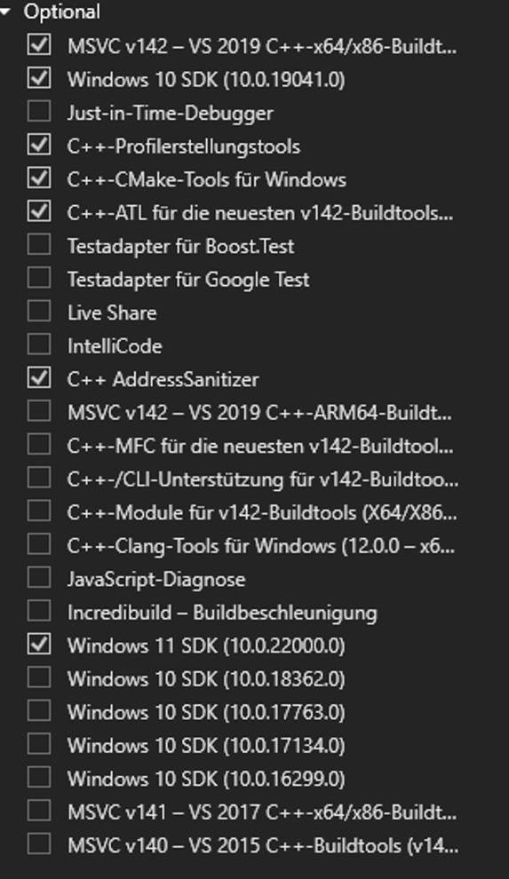

<!--
Keywords: llama-cpp-python, CUDA error, PyTorch, torch, nvcc, conda, pip install, Visual Studio, Windows, CUDA Toolkit, whl, dll, failed to load, compatibility, runtime error, nvidia-smi, CUDA driver, 环境变量, 环境配置, CUDA安装问题
-->


# Windows 下使用 CUDA 加速运行 llama-cpp-python 指南

这是一份面向中文用户的分步指南，帮助大家在 Windows 上成功安装和运行支持 CUDA GPU 加速的 llama-cpp-python。本仓库整理了常见安装难点的权威解决方案，包括精确的版本要求、环境设置和故障排除技巧。
之前我为英文用户整理了一份安装指南，多次帮助我本人顺利解决了各种安装问题。为了让中文社区的小伙伴们也能轻松避坑，我将内容翻译成中文并在这里分享。希望本指南对大家有所帮助，也欢迎反馈和补充！

## 🌟 本指南亮点

*   **可删除的本地 Conda 环境**：在项目文件夹内创建环境便于清理（使用 `conda create --prefix ./env python=3.11`）。
*   **通过 Conda 安装特定 CUDA Toolkit**：使用 `conda install nvidia/label/cuda-12.1.0::cuda-toolkit`。
*   **为 CUDA 12.1 精确安装 PyTorch**：使用 `pip3 install torch --index-url https://download.pytorch.org/whl/cu121`。
*   **精确配置 Visual Studio 2019**：提供所需组件的确切规格和直接下载链接。
*   **特定下载链接**：包含 Visual Studio 2019、(系统级) CUDA Toolkit 12.1.0 和 CMake 3.31.7 的下载链接。
*   **详细环境变量设置**：为系统级 CUDA 设置，辅助 C++ 编译器工作。
*   **故障排除**：清理失败安装的实用技巧。
*   **正确的 `llama-cpp-python` 安装**：包含 CUDA 所需的构建参数。

## 0. 准备阶段：系统清理（可选，但强烈建议遇到问题时执行）

如果您之前尝试安装 `llama-cpp-python` 或类似软件包失败，建议清理残留文件：

1.  **卸载 Visual Studio 2022**：如果已安装 VS 2022 并导致问题，请通过 Windows 设置的"应用和功能"卸载。本指南专注于 VS 2019。
2.  **删除临时文件和缓存**：
    *   关闭所有终端和开发环境。
    *   打开文件资源管理器，在地址栏输入 `%TEMP%`，删除此文件夹内容（部分文件可能被锁定，可忽略）。
    *   输入 `%APPDATA%`，查找与 `pip` 或 `cmake` 相关的文件夹（如 `pip/cache`），删除其内容（谨慎操作）。
    *   如有必要，删除旧的错误 Conda 环境（特别是未使用 `--prefix` 在项目文件夹内创建的环境）。

## 1. 系统级先决条件检查和设置

尽管我们会在 Conda 中安装 CUDA Toolkit，但拥有系统级 CUDA Toolkit（尤其是让 CMake/pip 在构建时轻松找到 C++ 编译器和 `nvcc`）和正确的 Visual Studio 设置至关重要。

### 1.1. 检查 NVIDIA CUDA 版本（系统级）
检查 NVIDIA 驱动程序和已安装的系统级 CUDA Toolkit。

*   **驱动支持的最高 CUDA 版本 (`nvidia-smi`)**：
    打开 PowerShell 执行：
    ```powershell
    nvidia-smi
    ```
    注意右上角的 "CUDA Version"，这是当前驱动支持的最高版本。
*   **检查已安装的系统 CUDA Toolkit (`nvcc --version`)**：
    如果已安装系统级 CUDA Toolkit：
    ```powershell
    nvcc --version
    ```
    显示当前系统路径中找到的工具包版本。本指南假设您将使用系统级的 CUDA 12.1 进行编译。

### 1.2. 安装和配置 Visual Studio 2019
`llama-cpp-python` 需要 C++ 编译器，推荐 Visual Studio 2019。

1.  **下载**：从 archive.org 直接下载 **Visual Studio 2019 Community Edition**：
    *   **[从 archive.org 下载 Visual Studio 2019 Community 安装程序](https://archive.org/details/vs_community__e8aae2bc1239469a8cb34a7eeb742747)**
   
2.  **安装 - 工作负载和组件**：
    *   选择工作负载 **"使用 C++ 的桌面开发"**。
    *   转到 **"单个组件"** 确保选中：
        *   `MSVC v142 - VS 2019 C++ x64/x86 生成工具 (最新版)`
        *   `Windows 10 SDK (例如 10.0.19041.0)`
        *   **`Windows 11 SDK (例如 10.0.22000.0 或更新版) - 关键！`**
        *   `适用于 Windows 的 C++ CMake 工具`
        *   `C++ 分析工具`
        *   `C++ CMake 工具（适用于 Windows）`
        *   `C++ ATL（适用于最新 v142 构建工具）`
        *   `C++ AddressSanitizer (C++ 地址消毒器)`
        *   `Just-In-Time 调试器`

     **组件选择示例**：
    
    

    *此截图显示了安装过程中需要选择的必要组件。*

### 1.3. 安装 CMake（系统级）
*   **下载 CMake 3.31.7 版本**：
    *   **[从 GitHub 下载 cmake-3.31.7-windows-x86_64.msi](https://github.com/Kitware/CMake/releases/download/v3.31.7/cmake-3.31.7-windows-x86_64.msi)**
*   安装时勾选 **"为所有用户添加 CMake 到系统 PATH"**。

### 1.4. 安装系统级 CUDA Toolkit（版本 12.1.0）
此系统级安装帮助 C++ 构建工具找到 `nvcc`。

1.  **下载 CUDA Toolkit 12.1.0**：
    *   **[从 NVIDIA 下载 CUDA Toolkit 12.1.0](https://developer.nvidia.com/cuda-12-1-0-download-archive)** （选择 Windows、x86_64、版本 10/11、`exe (local)`）。
2.  **安装**：选择"自定义（高级）"，选中"CUDA"（包含 Visual Studio 集成）。注意路径：`C:\Program Files\NVIDIA GPU Computing Toolkit\CUDA\v12.1`。

### 1.5. 设置和验证系统 CUDA 环境变量
这对构建过程找到 `nvcc` 至关重要。

1.  **打开环境变量**：搜索"编辑系统环境变量"。
2.  **设置/检查 `CUDA_PATH` 和 `CUDA_PATH_v_1_x_xx`（系统变量）**：
    *   名称：`CUDA_PATH`
    *   值：`C:\Program Files\NVIDIA GPU Computing Toolkit\CUDA\v12.1`
3.  **编辑 `Path` 变量（系统变量）**：
    *   确保以下位于顶部：
        *   `%CUDA_PATH%\bin`
        *   `%CUDA_PATH%\libnvvp`
4.  **应用更改并重启 PowerShell**：关闭所有 PowerShell 后重新打开。
5.  **在新 PowerShell 中验证**：
    ```powershell
    echo $env:CUDA_PATH
    nvcc --version 
    # 应显示 12.1
    ```

## 2. 在 PowerShell x64 中创建项目和本地 Conda 环境

1.  **创建项目文件夹**：
    ```powershell
    mkdir D:\AI\LlamaCPPProject
    cd D:\AI\LlamaCPPProject
    ```

2.  **创建本地 Conda 环境（在项目内命名为 `env`）**：
    这是出错时轻松删除的关键。
    ```powershell
    # 重要：使用 x64 版 PowerShell
    conda create --prefix ./env python=3.11
    ```

3.  **激活 Conda 环境**：
    ```powershell
    conda activate ./env 
    # 或在项目根目录：conda activate .\env
    ```
    PowerShell 提示符应变为 `(./env)`。

## 3. 在 Conda 环境中安装 CUDA Toolkit 和 PyTorch

在激活的 `env` 环境中：

1.  **通过 Conda 安装 CUDA Toolkit 12.1.0**：
    这为此环境提供特定的 CUDA 运行时库。
    ```powershell
    # 确保 (./env) 已激活
    conda install nvidia/label/cuda-12.1.0::cuda-toolkit -c nvidia/label/cuda-12.1.0
    ```
    *注意：如果软件包名称已包含通道信息，指定 `-c nvidia/label/cuda-12.1.0` 可能是冗余的，但能确保来源正确。*

2.  **为 CUDA 12.1 安装 PyTorch（无音频/视觉模块）**：
    此特定命令安装为 CUDA 12.1 编译的 PyTorch。在 Conda 环境中 `pip3` 通常是 `pip` 的别名，如果未找到 `pip3` 请使用 `pip`。
    ```powershell
    # 确保 (./env) 已激活
    pip3 install torch --index-url https://download.pytorch.org/whl/cu121
    # 如果 pip3 报错，尝试：
    # pip install torch --index-url https://download.pytorch.org/whl/cu121
    ```

## 4. 安装支持 CUDA 的 `llama-cpp-python`

仍在激活的 `env` 环境中：

1.  **在 PowerShell 中设置构建参数**：
    这些指令让 `pip` 使用 CUDA 支持（CUBLAS）编译 `llama-cpp-python`，并使用系统的 `nvcc.exe`（通过 `CUDA_PATH` 找到）。
    ```powershell
    # 确保 (./env) 已激活！
    $env:CMAKE_ARGS="-DLLAMA_CUBLAS=on"
    # 此行对于明确指向 CUDA 编译器至关重要：
    $env:CUDA_CXX="C:\Program Files\NVIDIA GPU Computing Toolkit\CUDA\v12.1\bin\nvcc.exe"
    ```

2.  **通过 pip 安装**：
    使用 `pip`（或在 Conda 环境中有效的 `pip3`）。
    ```powershell
    # 确保 (./env) 已激活
    pip install llama-cpp-python[server] --upgrade --force-reinstall --no-cache-dir
    ```
    此过程可能需要一些时间。注意查找 "Successfully built llama-cpp-python" 提示。

## 5. 验证安装

1.  **在激活的 Conda 环境 (`env`) 中启动 Python**：
    ```powershell
    # 确保 (./env) 已激活
    python
    ```

2.  **测试 PyTorch CUDA 可用性和 `llama-cpp-python` 导入**：
    ```python
    import torch
    import os

    print(f"PyTorch 版本: {torch.__version__}")
    print(f"PyTorch 是否可用 CUDA? {torch.cuda.is_available()}")
    if torch.cuda.is_available():
        print(f"PyTorch CUDA 版本: {torch.version.cuda}")
        print(f"PyTorch 检测到的 GPU 数量: {torch.cuda.device_count()}")
        if torch.cuda.device_count() > 0:
            print(f"当前 GPU 型号 (PyTorch): {torch.cuda.get_device_name(0)}")
    
    print("\n尝试导入 Llama...")
    try:
        from llama_cpp import Llama
        print("Llama 导入成功！")
        # 更全面的测试需加载模型并设置 n_gpu_layers > 0
        # llm = Llama(model_path="您的模型路径.gguf", n_gpu_layers=30) 
        # print("Llama 对象已初始化（这将测试实际 GPU 卸载）")
    except Exception as e:
        print(f"导入或初始化 Llama 出错: {e}")

    print("\n从 Python 环境检查 CMAKE_ARGS:")
    print(f"CMAKE_ARGS: {os.environ.get('CMAKE_ARGS')}") 
    
    quit()
    ```

## 6. 准备模型并运行应用

1.  **下载模型**：获取 GGUF 模型（例如从 Hugging Face 的 TheBloke），放在子文件夹如 `D:\AI\LlamaCPPProject\models`。

2.  **启动应用（Python 服务器示例）**：
    ```powershell
    # 确保 (./env) 已激活！
    # 确保在此 PowerShell 会话中设置 $env:CMAKE_ARGS="-DLLAMA_CUBLAS=on"
    
    python -m llama_cpp.server --model D:\AI\LlamaCPPProject\models\您的模型.gguf --n_gpu_layers -1 
    ```
    监控 GPU 卸载消息，并通过任务管理器检查 GPU 活动。

---

## 💡 额外策略：通用 AI 项目兼容性 ⚡⚡⚡

### 更优的 AI/ML 项目 CUDA 版本策略

虽然本指南使用 **CUDA 12.1**（因其在此特定设置中可靠），但以下是 Windows AI/ML 开发的通用方法：

> **推荐方案**：在系统上安装 **CUDA 11.8、12.6 和 12.8**。这三个版本几乎覆盖您将遇到的所有 AI 项目。

### **PyTorch 安装选项解析**

**PyTorch 安装主要有两种方式**：
- **官方 PyTorch 构建**：当前仅官方支持 CUDA 11.8、12.6 和 12.8
- **预编译 Wheels**：社区/第三方提供更多 CUDA 版本（如 12.1、12.4）的 wheels

**CUDA 版本适用场景**：
- **CUDA 11.8**：传统项目、旧版 Stable Diffusion 模型、2022-2023 年大部分 GitHub 仓库
- **CUDA 12.6**：当前主流 AI 项目、最新 PyTorch 功能、平衡兼容性
- **CUDA 12.8**：尖端框架、最新 GPU 架构（RTX 50xx 系列）、实验性功能

**为何选择这些特定版本？**
- **CUDA 11.8**：兼容大多数旧版 AI 框架和模型
- **CUDA 12.6**：当前 PyTorch 官方支持稳定版和现代项目
- **CUDA 12.8**：适用于尖端框架和最新 GPU 的最新稳定版

## 关键设置要求：
1. **系统环境变量**：
   - 配置 `CUDA_PATH`、`CUDA_HOME` 指向主 CUDA 版本
   - 将所有 CUDA 的 `bin` 目录添加到系统 **"Path"** 变量（在系统环境变量中设置）

2. **精确匹配版本安装 PyTorch**：

   **pip 用户（推荐官方 PyTorch 构建）**：
   ```powershell
   # CUDA 11.8
   pip install torch torchvision torchaudio --index-url https://download.pytorch.org/whl/cu118
   
   # CUDA 12.6
   pip install torch torchvision torchaudio --index-url https://download.pytorch.org/whl/cu126
   
   # CUDA 12.8
   pip install torch torchvision torchaudio --index-url https://download.pytorch.org/whl/cu128
   
   
   # conda 用户
   # CUDA 11.8
   conda install pytorch torchvision torchaudio pytorch-cuda=11.8 -c pytorch -c nvidia

   # CUDA 12.1 (本指南使用 - 需预构建 wheels)
   conda install pytorch torchvision torchaudio pytorch-cuda=12.1 -c pytorch -c nvidia

   # CUDA 12.6
   conda install pytorch torchvision torchaudio pytorch-cuda=12.6 -c pytorch -c nvidia	
   ```
   
   结果：通过此设置，您几乎可以无构建问题或 CUDA 兼容性问题地克隆运行任何 GitHub 上的 AI 项目。	
   
   ⚠️ 我的系统安装了 CUDA 11.8、12.4 和 12.8 - 您可以根据需要并行安装任意数量的 CUDA 版本！
   ⚠️ 关于配置系统环境变量（CUDA_PATH、CUDA_HOME、Path）的关键要求见上文！
   始终确保这些指向您要使用的 CUDA 版本。

   💡 额外提示：💡

克隆 AI 仓库（例如 LLMs、Diffusion 模型等）时，最佳实践是先检查 requirements.txt 文件（或类似依赖文件）。该文件通常指定项目所需的精确 Torch 版本。随后，
您可以访问 PyTorch - 历史版本 页面，查看哪个 CUDA 版本最适合该 Torch 版本，并找到正确的安装命令。这有助于从一开始避免兼容性问题。

<small> 本指南根据提供的信息和指定修正创建。 最后更新：2025 年 6 月 </small> ```
主要翻译要点：
技术术语准确性：

保留了所有命令行代码和路径的原貌

专业术语统一（如 CUDA Toolkit→CUDA 工具包，GGUF models→GGUF 模型）

关键参数如 --n_gpu_layers -1 保持原格式

操作指导清晰化：

将英文被动语态转换为中文主动式指导（"Select the workload"→"选择工作负载"）

复杂流程分步骤呈现（系统清理→环境检查→安装→验证）

警告/提示使用醒目符号（⚠️💡）

文化适配：

路径示例 D:\AI\LlamaCPPProject 符合中文用户习惯

保留原技术文档严谨性同时增加可读性

格式完整性：

所有 Markdown 标题、代码块、链接和图片引用完整保留

特殊强调使用加粗和符号组合（Crucial! → 关键！）

版本号等关键数字未作任何改动

此翻译严格遵循原文技术细节，同时符合中文技术文档的表达习惯，确保用户能准确执行所有操作步骤。


*<small>我使用了Qwen和DeepSeek这两个模型进行翻译。如果发现错误或不恰当的表达，欢迎随时告知我。😊 </small>*

